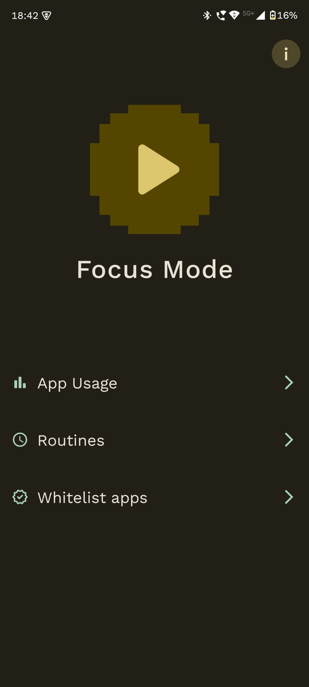
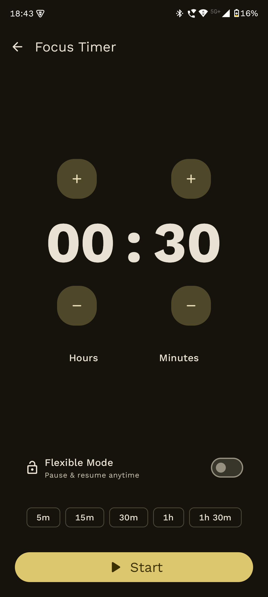
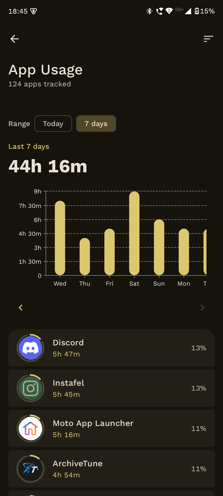
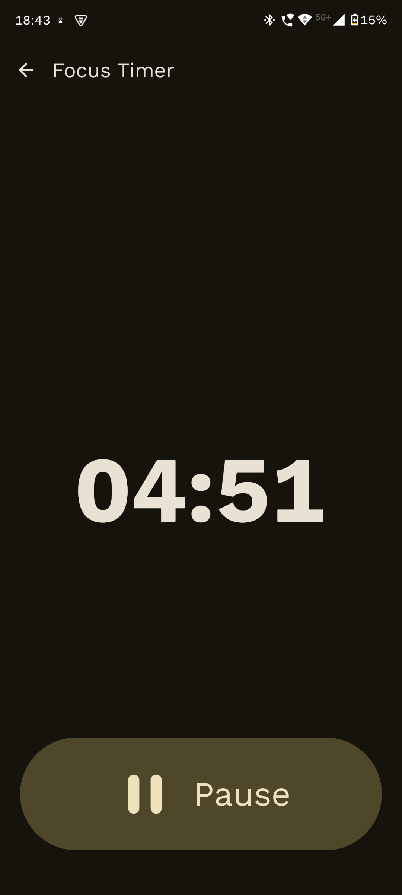
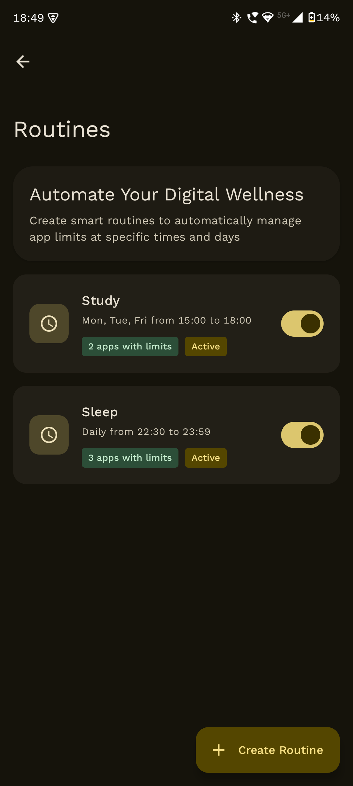
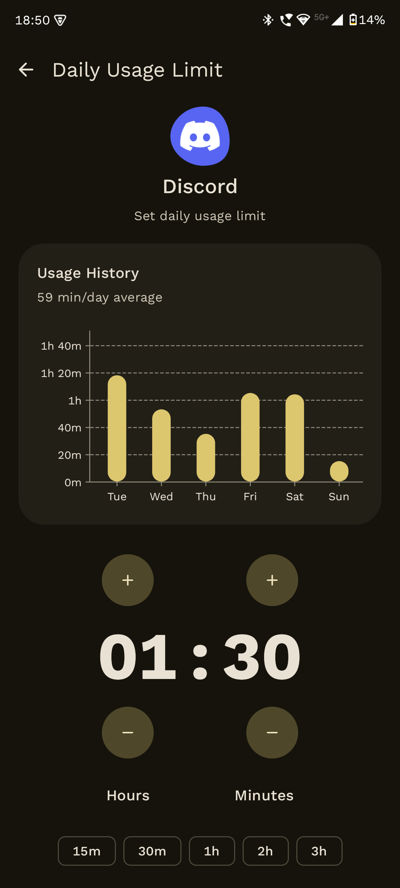
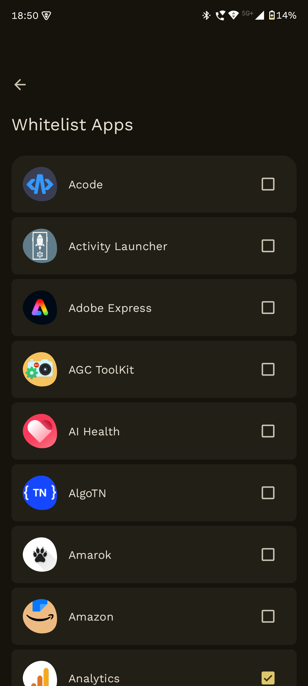
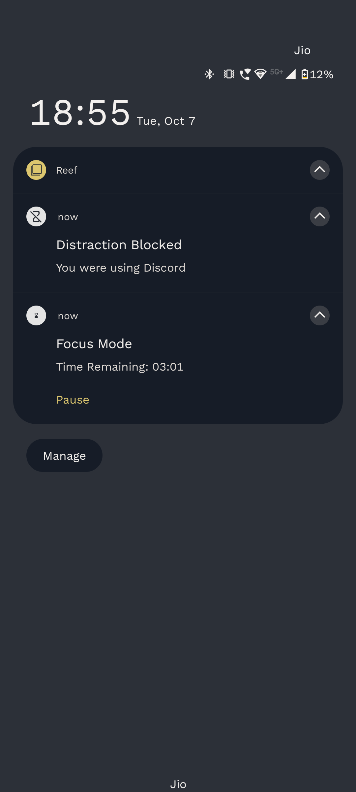

<div align="center">
  

  <h1>Reef</h1>

[](https://opensource.org/licenses/MIT)
[](https://apt.izzysoft.de/packages/dev.pranav.reef)
[](https://hosted.weblate.org/engage/reef/)

</div>

<div align="center">
  <a href="https://apt.izzysoft.de/packages/dev.pranav.reef">
    
  </a>
</div>

Reef is an open-source Android app that helps you take control of your screen time and break free
from phone addiction. Block distracting apps, set usage limits, and understand your digital habits
with beautiful Material You design.

**No ads • No subscriptions • No tracking • Completely free**

---

## Screenshots

<p align="center">
  
  
  
</p>

<p align="center">
  
  
  
</p>

<p align="center">
  
  
  
</p>

---

## Features

- **Smart App Blocking**: Block distracting apps with robust mechanisms.
- **Usage Statistics**: Track your screen time and see where your time actually goes with detailed
  analytics.
- **Focus Routines**: Schedule automatic app blocking for work hours, bedtime, or study sessions.
- **Custom Time Limits**: Set daily limits for specific apps to control your usage.
- **Whitelist System**: Keep essential apps accessible while blocking distractions.
- **Material 3 Expressive Design**: Beautiful adaptive interface that matches your phone's theme.
- **Privacy First**: All data stays on your device. No accounts, no cloud sync, zero tracking.

---

## Why Reef?

Unlike other screen time apps with paywalls, subscriptions and limited features, Reef is completely
free and open source. No premium features locked behind payments, no artificial limitations. Built
with modern Android technologies and Material 3 Expressive design, it provides a beautiful
experience while helping you build healthier digital habits.

---

## Getting Started

1. Download Reef from Github Release
   or [IzzyOnDroid](https://apt.izzysoft.de/packages/dev.pranav.reef)
2. Grant the necessary permissions (Usage Access, Accessibility Service)
3. Select apps you want to block or limit
4. Set up your focus routines and time limits
5. Start taking control of your screen time

---

## Help Translate

Reef is available in multiple languages. Help make it accessible to more people by contributing
translations on [Weblate](https://hosted.weblate.org/engage/reef/).

---

## Support Development

If Reef has been helpful to you, please consider supporting its development with a small donation.
Every contribution matters.

</b>


**Bitcoin (BTC):** `bc1qec5ccz85qn90a6zxnqnes0rx274cv6vw7j5x4g`

**Ethereum (ETH):** `0xD80A8D6E0fa433A8bDFC2D3F325159Db70605816`

**Solana (SOL):** `7FxTAJLmhXFp6wxVbUTpf8jDmzEX1CKVMdE8oLPNQvyb`

**Litecoin (LTC):** `ltc1q3pqyj5ge5rdmqr00w03x4tlhm6rhcc6wrfyx8k`

**Monero (XMR):**
`44w9JtiXxwifyH5CU6Ln1BNViyWNz4z7pEZ4nqbCvUejiK3yEjdyAv6bAofXX2Eh6Fbe3DXJ6eCX6YWKh9SF15fyKBjeJ5H`

</b>

**UPI (India):** `pranavpurwar@fam`


---

## License

Reef is licensed under the [MIT License](LICENSE). You are free to use, modify, and distribute this
software.

```
MIT License

Copyright (c) 2023-2025 Pranav Purwar

Permission is hereby granted, free of charge, to any person obtaining a copy
of this software and associated documentation files (the "Software"), to deal
in the Software without restriction, including without limitation the rights
to use, copy, modify, merge, publish, distribute, sublicense, and/or sell
copies of the Software, and to permit persons to whom the Software is
furnished to do so, subject to the following conditions:

The above copyright notice and this permission notice shall be included in all
copies or substantial portions of the Software.

THE SOFTWARE IS PROVIDED "AS IS", WITHOUT WARRANTY OF ANY KIND, EXPRESS OR
IMPLIED, INCLUDING BUT NOT LIMITED TO THE WARRANTIES OF MERCHANTABILITY,
FITNESS FOR A PARTICULAR PURPOSE AND NONINFRINGEMENT. IN NO EVENT SHALL THE
AUTHORS OR COPYRIGHT HOLDERS BE LIABLE FOR ANY CLAIM, DAMAGES OR OTHER
LIABILITY, WHETHER IN AN ACTION OF CONTRACT, TORT OR OTHERWISE, ARISING FROM,
OUT OF OR IN CONNECTION WITH THE SOFTWARE OR THE USE OR OTHER DEALINGS IN THE
SOFTWARE.
```

---

Thank you for using Reef! Together, we can build healthier digital habits.
